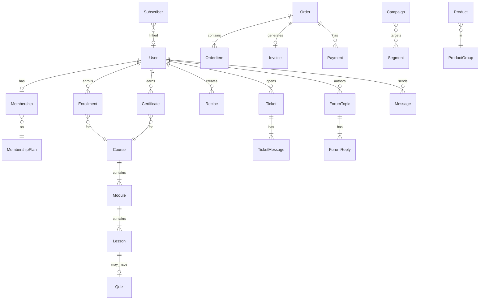

# Datenmodell – Alles-Wurst 2.0

**Version:** 1.0  
**Stand:** Juli 2026  
**Status:** Konzeptionell (keine Implementierung)  
**Bezug:** `PFLICHTENHEFT.md`, `ROLLENMODELL.md`  

---

## 1. Übersicht

Dieses Dokument beschreibt das **konzeptionelle Datenmodell** der Plattform. Es definiert Entitäten, Attribute, Beziehungen und Geschäftsregeln. Es ist **keine Datenbankimplementierung** und enthält keine SQL-Schemas oder Migrationsdateien.

### 1.1 Modellierungskonventionen

| Konvention | Bedeutung |
|------------|-----------|
| `id` | UUID, Primärschlüssel |
| `created_at`, `updated_at` | Zeitstempel (UTC) |
| `deleted_at` | Soft-Delete (nullable) |
| `status` | Enum-Feld für Zustandsmaschinen |
| `metadata` | JSON-Feld für erweiterbare Attribute |
| `→` | 1:n Beziehung |
| `↔` | n:m Beziehung |

### 1.2 Domänen-Übersicht

```
User ──┬── Membership ── MembershipPlan
       ├── Enrollment ── Course ── Module ── Lesson
       ├── Certificate
       ├── Recipe / Marinade
       ├── ForumPost / Message
       ├── Ticket
       ├── Invoice ── Payment
       └── NewsletterSubscriber

Product ── ProductGroup
AffiliateClick
```

---

## 2. Kern-Entitäten

### 2.1 User (Benutzer)

| Attribut | Typ | Beschreibung |
|----------|-----|--------------|
| id | UUID | Primärschlüssel |
| email | String | Eindeutig, normalisiert (lowercase) |
| email_verified_at | DateTime? | Verifizierungszeitpunkt |
| password_hash | String | Gehashtes Passwort |
| display_name | String | Öffentlicher Anzeigename |
| first_name | String? | Vorname |
| last_name | String? | Nachname |
| avatar_url | String? | Profilbild-URL |
| bio | Text? | Kurzbeschreibung |
| role | Enum | Systemrolle (siehe ROLLENMODELL) |
| status | Enum | `active`, `suspended`, `banned`, `deleted` |
| locale | String | Sprache (default: `de`) |
| timezone | String | Zeitzone (default: `Europe/Berlin`) |
| profile_visibility | Enum | `public`, `members_only`, `private` |
| meisterclub_override | Boolean | Admin-gewährter Meisterclub-Zugang |
| meisterclub_override_expires | DateTime? | Ablauf Override |
| last_login_at | DateTime? | Letzte Anmeldung |
| two_factor_enabled | Boolean | 2FA aktiv |
| metadata | JSON | Erweiterbare Felder |

**Beziehungen:**
- User → Membership (0..1 aktiv)
- User → Enrollment (0..n)
- User → Recipe (0..n)
- User → Ticket (0..n)
- User → Message (0..n als Sender/Empfänger)

### 2.2 UserPreference (Benutzereinstellungen)

| Attribut | Typ | Beschreibung |
|----------|-----|--------------|
| id | UUID | Primärschlüssel |
| user_id | UUID | FK → User |
| notification_email | JSON | E-Mail-Benachrichtigungen je Kategorie |
| notification_in_app | JSON | In-App-Benachrichtigungen je Kategorie |
| privacy_settings | JSON | Sichtbarkeit einzelner Profilfelder |
| newsletter_interests | String[] | Gewählte Interessen |

---

## 3. Mitgliedschaften

### 3.1 MembershipPlan (Mitgliedschaftsplan)

| Attribut | Typ | Beschreibung |
|----------|-----|--------------|
| id | UUID | Primärschlüssel |
| slug | String | `basis`, `premium`, `meister` |
| name | String | Anzeigename |
| description | Text | Marketing-Beschreibung |
| price_monthly | Decimal | Monatspreis (EUR) |
| price_yearly | Decimal | Jahrespreis (EUR) |
| features | JSON | Feature-Liste für Darstellung |
| access_rules | JSON | Maschinenlesbare Zugangsregeln |
| sort_order | Integer | Anzeigereihenfolge |
| is_active | Boolean | Plan buchbar |
| trial_days | Integer | Testphase (0 = keine) |

### 3.2 Membership (Aktive Mitgliedschaft)

| Attribut | Typ | Beschreibung |
|----------|-----|--------------|
| id | UUID | Primärschlüssel |
| user_id | UUID | FK → User |
| plan_id | UUID | FK → MembershipPlan |
| status | Enum | `active`, `past_due`, `cancelled`, `expired` |
| billing_cycle | Enum | `monthly`, `yearly` |
| current_period_start | DateTime | Aktuelle Periode Beginn |
| current_period_end | DateTime | Aktuelle Periode Ende |
| cancel_at_period_end | Boolean | Kündigung vorgemerkt |
| cancelled_at | DateTime? | Kündigungszeitpunkt |
| payment_provider_id | String? | Externe Subscription-ID |
| grace_period_ends | DateTime? | Ende der Kulanzzeit |

---

## 4. Akademie

### 4.1 LearningPath (Lernpfad)

| Attribut | Typ | Beschreibung |
|----------|-----|--------------|
| id | UUID | Primärschlüssel |
| slug | String | URL-Slug |
| title | String | Titel |
| description | Text | Beschreibung |
| thumbnail_url | String? | Vorschaubild |
| difficulty | Enum | `beginner`, `intermediate`, `advanced`, `master` |
| sort_order | Integer | Reihenfolge |
| is_published | Boolean | Veröffentlicht |

**Beziehung:** LearningPath ↔ Course (n:m, mit `sort_order`)

### 4.2 Course (Kurs)

| Attribut | Typ | Beschreibung |
|----------|-----|--------------|
| id | UUID | Primärschlüssel |
| slug | String | URL-Slug |
| title | String | Kurstitel |
| subtitle | String? | Untertitel |
| description | Text | Ausführliche Beschreibung |
| thumbnail_url | String? | Vorschaubild |
| trailer_video_url | String? | Trailer |
| author_id | UUID | FK → User (Kursautor) |
| difficulty | Enum | Schwierigkeitsgrad |
| duration_minutes | Integer | Geschätzte Dauer |
| price | Decimal? | Einzelpreis (null = nur über Mitgliedschaft) |
| access_type | Enum | `free`, `membership`, `purchase`, `membership_or_purchase` |
| required_membership_levels | String[] | Erforderliche Levels |
| is_featured | Boolean | Auf Startseite hervorgehoben |
| is_published | Boolean | Veröffentlicht |
| published_at | DateTime? | Veröffentlichungsdatum |
| certificate_enabled | Boolean | Zertifikat nach Abschluss |
| quiz_pass_percentage | Integer | Mindestpunktzahl Quiz (default: 80) |
| early_access_levels | String[] | Frühzugang (z. B. `meister`) |
| metadata | JSON | Tags, SEO, etc. |

### 4.3 Module (Kursmodul)

| Attribut | Typ | Beschreibung |
|----------|-----|--------------|
| id | UUID | Primärschlüssel |
| course_id | UUID | FK → Course |
| title | String | Modultitel |
| description | Text? | Beschreibung |
| sort_order | Integer | Reihenfolge im Kurs |

### 4.4 Lesson (Lektion)

| Attribut | Typ | Beschreibung |
|----------|-----|--------------|
| id | UUID | Primärschlüssel |
| module_id | UUID | FK → Module |
| title | String | Lektionstitel |
| type | Enum | `video`, `text`, `pdf`, `quiz`, `assignment` |
| content | Text? | Textinhalt (HTML/Markdown) |
| video_url | String? | Video-URL |
| video_duration_seconds | Integer? | Videolänge |
| pdf_url | String? | PDF-Anhang |
| sort_order | Integer | Reihenfolge im Modul |
| is_preview | Boolean | Kostenlose Vorschau |
| is_required | Boolean | Pflicht für Abschluss |

### 4.5 Quiz (Quiz einer Lektion)

| Attribut | Typ | Beschreibung |
|----------|-----|--------------|
| id | UUID | Primärschlüssel |
| lesson_id | UUID | FK → Lesson |
| title | String | Quiz-Titel |
| pass_percentage | Integer | Bestehensgrenze |
| max_attempts | Integer? | Max. Versuche (null = unbegrenzt) |
| time_limit_minutes | Integer? | Zeitlimit |

### 4.6 QuizQuestion

| Attribut | Typ | Beschreibung |
|----------|-----|--------------|
| id | UUID | Primärschlüssel |
| quiz_id | UUID | FK → Quiz |
| question_text | Text | Frage |
| type | Enum | `single_choice`, `multiple_choice`, `true_false` |
| options | JSON | Antwortoptionen mit `is_correct` |
| explanation | Text? | Erklärung nach Beantwortung |
| sort_order | Integer | Reihenfolge |

### 4.7 Enrollment (Kurseinschreibung)

| Attribut | Typ | Beschreibung |
|----------|-----|--------------|
| id | UUID | Primärschlüssel |
| user_id | UUID | FK → User |
| course_id | UUID | FK → Course |
| source | Enum | `membership`, `purchase`, `manual`, `gift` |
| status | Enum | `active`, `completed`, `expired` |
| progress_percentage | Integer | Gesamtfortschritt 0–100 |
| enrolled_at | DateTime | Einschreibungsdatum |
| completed_at | DateTime? | Abschlussdatum |
| last_accessed_at | DateTime? | Letzter Zugriff |

### 4.8 LessonProgress (Lektionsfortschritt)

| Attribut | Typ | Beschreibung |
|----------|-----|--------------|
| id | UUID | Primärschlüssel |
| enrollment_id | UUID | FK → Enrollment |
| lesson_id | UUID | FK → Lesson |
| status | Enum | `not_started`, `in_progress`, `completed` |
| video_position_seconds | Integer? | Video-Position |
| completed_at | DateTime? | Abschlusszeitpunkt |

### 4.9 QuizAttempt (Quiz-Versuch)

| Attribut | Typ | Beschreibung |
|----------|-----|--------------|
| id | UUID | Primärschlüssel |
| user_id | UUID | FK → User |
| quiz_id | UUID | FK → Quiz |
| answers | JSON | Gegebene Antworten |
| score_percentage | Integer | Erreichte Punktzahl |
| passed | Boolean | Bestanden |
| started_at | DateTime | Beginn |
| completed_at | DateTime? | Ende |

### 4.10 Certificate (Zertifikat)

| Attribut | Typ | Beschreibung |
|----------|-----|--------------|
| id | UUID | Primärschlüssel |
| certificate_number | String | Eindeutige Nummer (AW-CERT-YYYY-NNNNN) |
| user_id | UUID | FK → User |
| course_id | UUID | FK → Course |
| enrollment_id | UUID | FK → Enrollment |
| issued_at | DateTime | Ausstellungsdatum |
| revoked_at | DateTime? | Widerruf |
| revoke_reason | Text? | Widerrufsgrund |
| pdf_url | String? | Generiertes PDF |
| verification_token | String | Token für QR-Verifikation |

---

## 5. Community

### 5.1 ForumCategory

| Attribut | Typ | Beschreibung |
|----------|-----|--------------|
| id | UUID | Primärschlüssel |
| slug | String | URL-Slug |
| name | String | Kategoriename |
| description | Text? | Beschreibung |
| icon | String? | Icon-Identifier |
| sort_order | Integer | Reihenfolge |
| access_level | Enum | `public`, `members`, `premium`, `meister` |
| course_id | UUID? | Optional: Kurs-spezifische Kategorie |
| is_locked | Boolean | Nur Lesen |

### 5.2 ForumTopic

| Attribut | Typ | Beschreibung |
|----------|-----|--------------|
| id | UUID | Primärschlüssel |
| category_id | UUID | FK → ForumCategory |
| author_id | UUID | FK → User |
| title | String | Thementitel |
| content | Text | Eröffnungsbeitrag (HTML) |
| is_pinned | Boolean | Angepinnt |
| is_locked | Boolean | Gesperrt (keine neuen Antworten) |
| view_count | Integer | Aufrufe |
| reply_count | Integer | Antworten (denormalisiert) |
| last_reply_at | DateTime? | Letzte Antwort |
| last_reply_user_id | UUID? | Letzter Antwortender |

### 5.3 ForumReply

| Attribut | Typ | Beschreibung |
|----------|-----|--------------|
| id | UUID | Primärschlüssel |
| topic_id | UUID | FK → ForumTopic |
| author_id | UUID | FK → User |
| content | Text | Antwort (HTML) |
| is_solution | Boolean | Als Lösung markiert |
| parent_reply_id | UUID? | FK → ForumReply (Verschachtelung) |

### 5.4 Message (Direktnachricht)

| Attribut | Typ | Beschreibung |
|----------|-----|--------------|
| id | UUID | Primärschlüssel |
| conversation_id | UUID | FK → Conversation |
| sender_id | UUID | FK → User |
| content | Text | Nachrichtentext |
| read_at | DateTime? | Gelesen-Zeitpunkt |
| attachment_url | String? | Anhang |

### 5.5 Conversation

| Attribut | Typ | Beschreibung |
|----------|-----|--------------|
| id | UUID | Primärschlüssel |
| participants | UUID[] | Teilnehmer-IDs |
| last_message_at | DateTime? | Letzte Nachricht |
| created_at | DateTime | Erstellt |

### 5.6 UserBadge

| Attribut | Typ | Beschreibung |
|----------|-----|--------------|
| id | UUID | Primärschlüssel |
| user_id | UUID | FK → User |
| badge_type | Enum | `course_complete`, `forum_contributor`, `recipe_published`, etc. |
| reference_id | UUID? | Verknüpfte Entität |
| awarded_at | DateTime | Vergeben am |

### 5.7 Report (Meldung)

| Attribut | Typ | Beschreibung |
|----------|-----|--------------|
| id | UUID | Primärschlüssel |
| reporter_id | UUID | FK → User |
| target_type | Enum | `forum_topic`, `forum_reply`, `message`, `profile` |
| target_id | UUID | Gemeldete Entität |
| reason | Enum | `spam`, `harassment`, `off_topic`, `other` |
| description | Text? | Beschreibung |
| status | Enum | `open`, `reviewed`, `action_taken`, `dismissed` |
| reviewed_by | UUID? | FK → User (Moderator) |

---

## 6. Support

### 6.1 Ticket

| Attribut | Typ | Beschreibung |
|----------|-----|--------------|
| id | UUID | Primärschlüssel |
| ticket_number | String | AW-TKT-YYYY-NNNNN |
| user_id | UUID | FK → User |
| assigned_agent_id | UUID? | FK → User (Support-Agent) |
| subject | String | Betreff |
| category | Enum | `technical`, `billing`, `course_content`, `membership`, `tools`, `other` |
| priority | Enum | `low`, `normal`, `high`, `urgent` |
| status | Enum | `new`, `seen`, `in_progress`, `waiting`, `resolved`, `closed` |
| created_at | DateTime | Erstellt |
| updated_at | DateTime | Aktualisiert |
| resolved_at | DateTime? | Gelöst |
| closed_at | DateTime? | Geschlossen |

### 6.2 TicketMessage

| Attribut | Typ | Beschreibung |
|----------|-----|--------------|
| id | UUID | Primärschlüssel |
| ticket_id | UUID | FK → Ticket |
| author_id | UUID | FK → User |
| content | Text | Nachricht |
| is_internal | Boolean | Interne Notiz (nur Agenten) |
| attachment_urls | String[] | Anhänge |

---

## 7. Newsletter

### 7.1 Subscriber

| Attribut | Typ | Beschreibung |
|----------|-----|--------------|
| id | UUID | Primärschlüssel |
| email | String | E-Mail (eindeutig) |
| user_id | UUID? | FK → User (wenn registriert) |
| status | Enum | `pending`, `active`, `unsubscribed`, `bounced`, `complained` |
| confirmed_at | DateTime? | DOI bestätigt |
| unsubscribed_at | DateTime? | Abgemeldet |
| interests | String[] | Gewählte Interessen |
| frequency | Enum | `weekly`, `biweekly`, `monthly` |
| membership_level | String? | Sync aus Mitgliedschaft |
| metadata | JSON | Sync-Daten (Kurse, etc.) |
| consent_log | JSON[] | Consent-Nachweise |

### 7.2 Segment

| Attribut | Typ | Beschreibung |
|----------|-----|--------------|
| id | UUID | Primärschlüssel |
| name | String | Segmentname |
| description | Text? | Beschreibung |
| rules | JSON | Regelwerk (AND/OR, Bedingungen) |
| subscriber_count | Integer | Anzahl (denormalisiert) |
| last_calculated_at | DateTime? | Letzte Neuberechnung |

### 7.3 Campaign

| Attribut | Typ | Beschreibung |
|----------|-----|--------------|
| id | UUID | Primärschlüssel |
| name | String | Interner Name |
| subject | String | E-Mail-Betreff |
| preview_text | String? | Preheader |
| template_id | UUID? | FK → EmailTemplate |
| content_blocks | JSON | Block-basierter Inhalt |
| segment_ids | UUID[] | Zielsegmente |
| status | Enum | `draft`, `scheduled`, `sending`, `sent`, `cancelled` |
| scheduled_at | DateTime? | Geplanter Versand |
| sent_at | DateTime? | Tatsächlicher Versand |
| stats | JSON | opens, clicks, bounces |

### 7.4 Automation

| Attribut | Typ | Beschreibung |
|----------|-----|--------------|
| id | UUID | Primärschlüssel |
| name | String | Name |
| trigger | JSON | Auslöser (z. B. `course_completed`) |
| conditions | JSON | Bedingungen |
| actions | JSON | Aktionen (E-Mail senden, Tag setzen) |
| is_active | Boolean | Aktiv |

---

## 8. Werkstatt

### 8.1 Product (Affiliate-Produkt)

| Attribut | Typ | Beschreibung |
|----------|-----|--------------|
| id | UUID | Primärschlüssel |
| group_id | UUID | FK → ProductGroup |
| name | String | Produktname |
| description | Text? | Beschreibung |
| image_url | String? | Produktbild |
| affiliate_url | String | Affiliate-Link |
| affiliate_network | String? | Netzwerk (Amazon, Awin) |
| price_display | String? | Anzeigepreis |
| rating | Decimal? | Bewertung 1–5 |
| is_featured | Boolean | Hervorgehoben |
| is_active | Boolean | Aktiv |
| sort_order | Integer | Reihenfolge |

### 8.2 ProductGroup

| Attribut | Typ | Beschreibung |
|----------|-----|--------------|
| id | UUID | Primärschlüssel |
| slug | String | URL-Slug |
| name | String | Gruppenname |
| description | Text? | Beschreibung |
| icon | String? | Icon |
| sort_order | Integer | Reihenfolge |

### 8.3 Recipe (Wurstrezept)

| Attribut | Typ | Beschreibung |
|----------|-----|--------------|
| id | UUID | Primärschlüssel |
| user_id | UUID | FK → User |
| name | String | Rezeptname |
| category | Enum | Wurstkategorie |
| description | Text? | Beschreibung |
| visibility | Enum | `private`, `public`, `database` |
| payload | JSON | Vollständige Rezeptdaten (Fleisch, Gewürze, etc.) |
| analysis_snapshot | JSON? | Letzter Analyse-Snapshot |
| analysis_score | Integer? | Gesamt-Score |
| created_at | DateTime | Erstellt |
| updated_at | DateTime | Aktualisiert |

**Payload-Struktur (JSON):**
```json
{
  "meats": [{"type": "Schwein", "percentage": 70}, {"type": "Speck", "percentage": 30}],
  "schuettung": {"water_g_per_kg": 50, "nitrite_mg_per_kg": 7.5},
  "spices": [{"name": "Pfeffer", "g_per_kg": 2.5}],
  "casing": {"type": "Schweinedarm", "caliber_mm": 32},
  "production": {"steps": ["mahlen", "mischen", "füllen", "kochen"]},
  "smoking": {"phases": [{"temp_c": 60, "duration_min": 120}]}
}
```

### 8.4 Marinade

| Attribut | Typ | Beschreibung |
|----------|-----|--------------|
| id | UUID | Primärschlüssel |
| user_id | UUID | FK → User |
| name | String | Name |
| type | Enum | `wet`, `dry`, `injection`, `custom` |
| meat_type | String | Fleischsorte |
| ingredients | JSON | Zutatenliste |
| marinade_percentage | Decimal | Marinadenanteil % |
| visibility | Enum | `private`, `public` |
| status | Enum | `draft`, `published`, `review` |

### 8.5 AnalysisReference (Referenzprofil)

| Attribut | Typ | Beschreibung |
|----------|-----|--------------|
| id | UUID | Primärschlüssel |
| category | String | Wurstkategorie |
| name | String | Profilname |
| profile | JSON | Referenz-Kennlinien S1–S10, R1–R5 |
| is_default | Boolean | Standard für Kategorie |

---

## 9. Zahlung

### 9.1 Order (Bestellung)

| Attribut | Typ | Beschreibung |
|----------|-----|--------------|
| id | UUID | Primärschlüssel |
| order_number | String | AW-ORD-YYYY-NNNNN |
| user_id | UUID | FK → User |
| type | Enum | `membership`, `course`, `mixed` |
| status | Enum | `pending`, `paid`, `failed`, `refunded`, `cancelled` |
| subtotal | Decimal | Netto |
| tax_amount | Decimal | Steuer |
| total | Decimal | Brutto |
| currency | String | Währung (EUR) |
| payment_provider | String | stripe, mollie |
| payment_provider_id | String? | Externe ID |
| paid_at | DateTime? | Bezahlt am |

### 9.2 OrderItem

| Attribut | Typ | Beschreibung |
|----------|-----|--------------|
| id | UUID | Primärschlüssel |
| order_id | UUID | FK → Order |
| item_type | Enum | `membership_plan`, `course` |
| item_id | UUID | Referenz-ID |
| description | String | Positionsbeschreibung |
| quantity | Integer | Menge (meist 1) |
| unit_price | Decimal | Einzelpreis |
| tax_rate | Decimal | Steuersatz % |

### 9.3 Invoice (Rechnung)

| Attribut | Typ | Beschreibung |
|----------|-----|--------------|
| id | UUID | Primärschlüssel |
| invoice_number | String | AW-INV-YYYY-NNNNN |
| order_id | UUID | FK → Order |
| user_id | UUID | FK → User |
| status | Enum | `draft`, `issued`, `paid`, `cancelled`, `credited` |
| billing_address | JSON | Rechnungsadresse |
| line_items | JSON | Positionen |
| subtotal | Decimal | Netto |
| tax_amount | Decimal | Steuer |
| total | Decimal | Brutto |
| issued_at | DateTime | Ausstellungsdatum |
| due_at | DateTime? | Fälligkeitsdatum |
| paid_at | DateTime? | Bezahlt am |
| pdf_url | String? | PDF-URL |
| credit_note_for | UUID? | FK → Invoice (Storno) |

### 9.4 Payment (Zahlung)

| Attribut | Typ | Beschreibung |
|----------|-----|--------------|
| id | UUID | Primärschlüssel |
| order_id | UUID | FK → Order |
| amount | Decimal | Betrag |
| currency | String | Währung |
| method | Enum | `card`, `sepa`, `paypal` |
| status | Enum | `pending`, `succeeded`, `failed`, `refunded` |
| provider | String | Zahlungsanbieter |
| provider_payment_id | String | Externe ID |
| failure_reason | String? | Fehlergrund |
| processed_at | DateTime? | Verarbeitet am |

---

## 10. System

### 10.1 AuditLog

| Attribut | Typ | Beschreibung |
|----------|-----|--------------|
| id | UUID | Primärschlüssel |
| actor_id | UUID? | FK → User |
| action | String | z. B. `user.role_changed` |
| target_type | String? | Betroffene Entität |
| target_id | UUID? | Entitäts-ID |
| old_values | JSON? | Vorher |
| new_values | JSON? | Nachher |
| ip_address | String? | IP |
| created_at | DateTime | Zeitpunkt |

### 10.2 Media

| Attribut | Typ | Beschreibung |
|----------|-----|--------------|
| id | UUID | Primärschlüssel |
| filename | String | Dateiname |
| mime_type | String | MIME-Typ |
| size_bytes | Integer | Größe |
| url | String | CDN-URL |
| uploaded_by | UUID | FK → User |
| alt_text | String? | Alt-Text |
| metadata | JSON | Dimensionen, etc. |

### 10.3 Setting

| Attribut | Typ | Beschreibung |
|----------|-----|--------------|
| id | UUID | Primärschlüssel |
| key | String | Einstellungsschlüssel |
| value | JSON | Wert |
| group | String | Gruppe (billing, newsletter, etc.) |

---

## 11. ER-Diagramm (vereinfacht)



---

## 12. Indexierung und Performance (Planung)

| Entität | Empfohlene Indizes |
|---------|-------------------|
| User | `email` (unique), `status`, `role` |
| Course | `slug` (unique), `is_published`, `author_id` |
| Enrollment | `user_id + course_id` (unique), `status` |
| ForumTopic | `category_id`, `last_reply_at` |
| Ticket | `user_id`, `status`, `assigned_agent_id` |
| Subscriber | `email` (unique), `status` |
| Recipe | `user_id`, `visibility`, `category` |
| Order | `user_id`, `status`, `order_number` (unique) |

---

*Dieses Datenmodell wird vor Implementierungsbeginn durch ein technisches Review validiert.*
