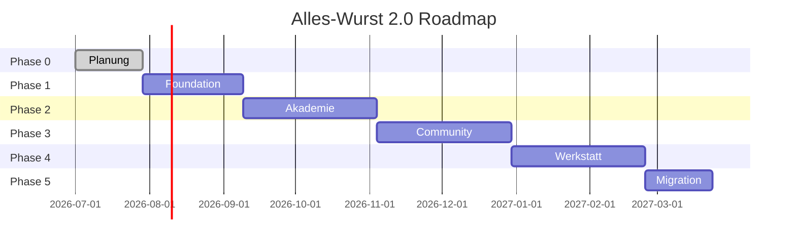

# Roadmap – Alles-Wurst 2.0

**Version:** 1.0  
**Stand:** Juli 2026  
**Status:** Planungsphase  
**Bezug:** Alle Fachdokumente in `/docs`  

---

## 1. Übersicht

Diese Roadmap beschreibt die phasenweise Implementierung von Alles-Wurst 2.0. Jede Phase baut auf der vorherigen auf und liefert ein nutzbares Inkrement. Die Planungsphase (aktuelle Phase) ist abgeschlossen, sobald alle Dokumente erstellt und freigegeben sind.

### 1.1 Prinzipien

- **Inkrementell:** Jede Phase liefert nutzbaren Wert
- **Migration-ready:** Parallelbetrieb mit WordPress bis Cutover
- **Qualität:** Tests und Review vor jedem Release
- **Dokumentation:** Code und APIs dokumentieren

### 1.2 Meilensteine

| Phase | Name | Ziel | Dauer (geschätzt) |
|-------|------|------|-------------------|
| 0 | Planung | Dokumentation, Design | 4 Wochen |
| 1 | Foundation | Basis-Infrastruktur, Auth | 6 Wochen |
| 2 | Akademie | Kursystem, Zertifikate | 8 Wochen |
| 3 | Community & Commerce | Mitgliedschaften, Forum, Zahlung | 8 Wochen |
| 4 | Werkstatt & Newsletter | Tools, E-Mail | 8 Wochen |
| 5 | Migration & Launch | Datenmigration, Go-Live | 4 Wochen |
| **Gesamt** | | | **~38 Wochen** |

---

## 2. Phase 0: Planung ✓

**Status:** In Bearbeitung  
**Ziel:** Vollständige Konzeption und Dokumentation

### 2.1 Deliverables

| Dokument | Status |
|----------|--------|
| LASTENHEFT.md | ✓ |
| PFLICHTENHEFT.md | ✓ |
| ROLLENMODELL.md | ✓ |
| DATENMODELL.md | ✓ |
| SEITENSTRUKTUR.md | ✓ |
| ADMINBEREICH.md | ✓ |
| KURSSYSTEM.md | ✓ |
| MITGLIEDSCHAFTEN.md | ✓ |
| COMMUNITY.md | ✓ |
| ZAHLUNGSSYSTEM.md | ✓ |
| NEWSLETTER.md | ✓ |
| ROADMAP.md | ✓ |

### 2.2 Nächste Schritte (nach Dokumentation)

- [ ] Dokumenten-Review und Freigabe
- [ ] UI/UX Wireframes (basierend auf SEITENSTRUKTUR)
- [ ] Designsystem implementieren (Brandbook v3.0)
- [ ] Technische Architektur finalisieren
- [ ] Entwicklungsumgebung aufsetzen

---

## 3. Phase 1: Foundation

**Dauer:** 6 Wochen  
**Ziel:** Lauffähige Basis-Plattform mit Auth und Admin-Grundgerüst

### 3.1 Infrastruktur

| Task | Beschreibung | Priorität |
|------|--------------|-----------|
| Projekt-Setup | Next.js, TypeScript, Tailwind, ESLint | Muss |
| Datenbank | PostgreSQL, Prisma/Drizzle ORM | Muss |
| CI/CD | GitHub Actions, Staging, Production | Muss |
| Hosting | Vercel/Railway + DB (EU) | Muss |
| CDN | Cloudflare R2 für Medien | Soll |
| Monitoring | Sentry, Uptime | Soll |

### 3.2 Benutzerverwaltung

| Task | Beschreibung | Priorität |
|------|--------------|-----------|
| User-Modell | CRUD, Soft-Delete | Muss |
| Registrierung | E-Mail, Passwort, DOI | Muss |
| Login/Logout | Session-basiert | Muss |
| Passwort-Reset | Token-basiert | Muss |
| Profil | Anzeigename, Avatar, Bio | Muss |
| Rollen | RBAC-Grundgerüst | Muss |
| DSGVO | Export, Löschung | Muss |

### 3.3 Frontend

| Task | Beschreibung | Priorität |
|------|--------------|-----------|
| Designsystem | Tokens, Komponenten | Muss |
| Layouts | Marketing, Auth, App | Muss |
| Startseite | Marketing (statisch) | Muss |
| Login/Register | Formulare | Muss |
| Mein Bereich | Dashboard-Grundgerüst | Muss |
| Responsive | Mobile First | Muss |

### 3.4 Admin

| Task | Beschreibung | Priorität |
|------|--------------|-----------|
| Admin-Layout | Sidebar, Navigation | Muss |
| Dashboard | Platzhalter-Widgets | Soll |
| Benutzerverwaltung | Liste, Detail, Rollen | Muss |
| Einstellungen | Grundkonfiguration | Soll |

### 3.5 Akzeptanzkriterien Phase 1

- [ ] Nutzer kann sich registrieren, E-Mail bestätigen, einloggen
- [ ] Nutzer kann Profil bearbeiten
- [ ] Admin kann Benutzer verwalten
- [ ] Startseite ist öffentlich erreichbar
- [ ] Lighthouse Performance ≥ 90
- [ ] Unit Tests für Auth-Flows

---

## 4. Phase 2: Akademie

**Dauer:** 8 Wochen  
**Ziel:** Vollständiges Kurssystem mit Zertifikaten

### 4.1 Kursverwaltung

| Task | Beschreibung | Priorität |
|------|--------------|-----------|
| Course-Modell | CRUD, Status-Workflow | Muss |
| Module/Lektionen | Hierarchie, Sortierung | Muss |
| Lektionstypen | Video, Text, PDF | Muss |
| Quiz-System | Fragen, Auswertung | Muss |
| Lernpfade | Kurse zuordnen | Soll |
| Kurs-Editor (Admin) | Vollständiger Editor | Muss |

### 4.2 Lernen

| Task | Beschreibung | Priorität |
|------|--------------|-----------|
| Kurskatalog | Liste, Filter | Muss |
| Kursdetail | Informationen, CTA | Muss |
| Kurs-Player | Lektionen absolvieren | Muss |
| Fortschritt | Tracking, Anzeige | Muss |
| Quiz absolvieren | Bestehen/Nichtbestehen | Muss |
| Vorschau-Lektionen | Öffentlich zugänglich | Soll |

### 4.3 Zertifikate

| Task | Beschreibung | Priorität |
|------|--------------|-----------|
| Ausstellung | Nach Kursabschluss | Muss |
| PDF-Generierung | Branding-konform | Muss |
| Verifikation | Öffentliche URL | Muss |
| Nutzer-Ansicht | Download, Teilen | Muss |

### 4.4 Integration

| Task | Beschreibung | Priorität |
|------|--------------|-----------|
| Video-Hosting | Vimeo/Bunny Embed | Muss |
| Medienbibliothek | Upload, Verwaltung | Muss |
| Einschreibung | Manuell (Admin) | Muss |

### 4.5 Akzeptanzkriterien Phase 2

- [ ] Admin kann Kurs mit Modulen/Lektionen erstellen
- [ ] Nutzer kann Kurs absolvieren (manuell eingeschrieben)
- [ ] Fortschritt wird korrekt getrackt
- [ ] Quiz funktioniert, Bestehensgrenze greift
- [ ] Zertifikat wird ausgestellt und ist verifizierbar
- [ ] E2E-Test: Kurs absolvieren → Zertifikat

---

## 5. Phase 3: Community & Commerce

**Dauer:** 8 Wochen  
**Ziel:** Mitgliedschaften, Zahlungen, Forum, Support

### 5.1 Mitgliedschaften

| Task | Beschreibung | Priorität |
|------|--------------|-----------|
| MembershipPlan | 3 Pläne konfigurieren | Muss |
| Feature-Gating | Zugangsregeln | Muss |
| Mitgliedschaftsseite | Vergleich, CTA | Muss |
| Nutzer-Verwaltung | Upgrade, Kündigung | Muss |
| Meisterclub-Bereich | Grundgerüst | Soll |

### 5.2 Zahlungen

| Task | Beschreibung | Priorität |
|------|--------------|-----------|
| Stripe-Integration | Checkout, Subscriptions | Muss |
| Checkout-Flow | Mitgliedschaft, Kurs | Muss |
| Webhooks | Zahlungsstatus | Muss |
| Rechnungen | PDF-Generierung | Muss |
| Rechnungshistorie | Nutzer-Ansicht | Muss |
| Grace Period | Bei Fehlzahlung | Soll |

### 5.3 Kurs-Commerce

| Task | Beschreibung | Priorität |
|------|--------------|-----------|
| Kurszugang via Mitgliedschaft | Automatisch | Muss |
| Einzelkurskauf | Checkout | Muss |
| Rabatte | Mitgliedschafts-Rabatt | Soll |

### 5.4 Forum

| Task | Beschreibung | Priorität |
|------|--------------|-----------|
| Kategorien | CRUD, Zugangsregeln | Muss |
| Themen | Erstellen, Liste | Muss |
| Antworten | Threaded (1 Ebene) | Muss |
| Moderation | Melden, Löschen | Muss |
| Suche | Volltext | Soll |

### 5.5 Direktnachrichten

| Task | Beschreibung | Priorität |
|------|--------------|-----------|
| Konversationen | 1:1 | Muss |
| Nachrichten senden | Text, Anhang | Muss |
| Benachrichtigungen | In-App | Muss |

### 5.6 Support

| Task | Beschreibung | Priorität |
|------|--------------|-----------|
| Ticket-System | Erstellen, Status | Muss |
| Agent-Ansicht | Admin-Bearbeitung | Muss |
| E-Mail-Benachrichtigungen | Statusänderungen | Muss |
| Kategorien/Prioritäten | Konfigurierbar | Muss |

### 5.7 Akzeptanzkriterien Phase 3

- [ ] Nutzer kann Mitgliedschaft abschließen (Stripe Test)
- [ ] Zahlung löst Zugang aus
- [ ] Rechnung wird erstellt
- [ ] Forum: Thema erstellen, antworten
- [ ] DM: Nachricht senden und empfangen
- [ ] Support: Ticket erstellen, Agent antwortet
- [ ] E2E-Test: Mitgliedschaft kaufen → Kurs zugänglich

---

## 6. Phase 4: Werkstatt & Newsletter

**Dauer:** 8 Wochen  
**Ziel:** Alle Tools und E-Mail-Marketing

### 6.1 Werkstatt-Tools

| Task | Beschreibung | Priorität |
|------|--------------|-----------|
| Salzrechner | Berechnung, UI | Muss |
| Lakerechner | Berechnung, PDF | Muss |
| Rezeptgenerator | CRUD, Berechnung, PDF | Muss |
| Marinaden-Generator | CRUD, PDF | Muss |
| Rezeptdatenbank | Lesen, Filtern | Soll |
| Rezeptanalyse | Meisterwerkstatt | Soll |
| Affiliate-Katalog | Produkte, Gruppen | Muss |

### 6.2 Newsletter

| Task | Beschreibung | Priorität |
|------|--------------|-----------|
| Abonnenten | DOI, Verwaltung | Muss |
| Segmente | Regel-Engine | Muss |
| Kampagnen | Editor, Versand | Muss |
| Automationen | Trigger, Aktionen | Soll |
| Tracking | Öffnungen, Klicks | Soll |
| Provider-Integration | Brevo/SendGrid | Muss |

### 6.3 Meisterclub (Erweiterung)

| Task | Beschreibung | Priorität |
|------|--------------|-----------|
| Exklusive Inhalte | CMS-Integration | Soll |
| Mentoring-Anfragen | Formular, Queue | Soll |
| Rankings | Analyse-basiert | Kann |

### 6.4 Akzeptanzkriterien Phase 4

- [ ] Salzrechner liefert korrekte Ergebnisse (Testfälle)
- [ ] Lakerechner mit PDF-Export funktioniert
- [ ] Rezeptgenerator: Erstellen, Speichern, PDF
- [ ] Newsletter: DOI, Kampagne versenden
- [ ] Segmentierung funktioniert
- [ ] Affiliate-Katalog mit Disclosure

---

## 7. Phase 5: Migration & Launch

**Dauer:** 4 Wochen  
**Ziel:** Produktiver Betrieb, WordPress abgelöst

### 7.1 Datenmigration

| Task | Beschreibung | Priorität |
|------|--------------|-----------|
| Migrations-Skripte | User, Kurse, etc. | Muss |
| Staging-Migration | Testlauf | Muss |
| Datenvalidierung | Vollständigkeit, Integrität | Muss |
| Produktions-Migration | Finaler Import | Muss |
| Passwort-Reset | Für alle migrierten User | Muss |

### 7.2 Qualitätssicherung

| Task | Beschreibung | Priorität |
|------|--------------|-----------|
| E2E-Tests | Alle kritischen Journeys | Muss |
| Lasttests | 100 gleichzeitige User | Soll |
| Security-Audit | OWASP Top 10 | Muss |
| Accessibility-Audit | WCAG 2.1 AA | Soll |
| Browser-Tests | Chrome, Firefox, Safari, Edge | Muss |

### 7.3 Launch

| Task | Beschreibung | Priorität |
|------|--------------|-----------|
| DNS-Umstellung | alles-wurst.de → neue Plattform | Muss |
| SSL-Zertifikat | HTTPS | Muss |
| Monitoring | Alerts konfigurieren | Muss |
| Rollback-Plan | Falls kritische Fehler | Muss |
| Kommunikation | E-Mail an Mitglieder | Muss |
| WordPress | Read-only, dann abschalten | Muss |

### 7.4 Post-Launch

| Task | Beschreibung | Priorität |
|------|--------------|-----------|
| Bug-Fixing | Erste 2 Wochen priorisiert | Muss |
| Performance-Monitoring | Optimieren | Soll |
| Feedback sammeln | Support-Tickets, Umfrage | Soll |
| Dokumentation | Admin-Handbuch | Soll |

### 7.5 Akzeptanzkriterien Phase 5

- [ ] Alle migrierten Daten validiert
- [ ] Keine kritischen Bugs in Production
- [ ] Uptime ≥ 99,5 % in ersten 7 Tagen
- [ ] Support-Anfragen bearbeitbar
- [ ] WordPress erfolgreich abgelöst

---

## 8. Abhängigkeiten

### 8.1 Kritische Abhängigkeiten

| Phase | Abhängig von | Blocker |
|-------|--------------|---------|
| 2 | 1 | Auth, User-Modell |
| 3 | 2 | Kurse für Kurszugang |
| 3 | 1 | Auth für Forum/DM |
| 4 | 3 | Mitgliedschaft für Feature-Gating |
| 5 | 1-4 | Alle Module |

---

## 9. Risiken und Mitigationen

| Risiko | Wahrscheinlichkeit | Impact | Mitigation |
|--------|-------------------|--------|------------|
| Scope Creep | Hoch | Hoch | Strikte Phasen, MVP pro Phase |
| Migrationsfehler | Mittel | Hoch | Staging-Tests, Rollback-Plan |
| Zahlungsintegration | Niedrig | Hoch | Stripe-Testmodus, Webhook-Tests |
| Performance | Mittel | Mittel | CDN, Caching, Lasttests |
| Team-Kapazität | Mittel | Hoch | Priorisierung, externe Hilfe |
| Rechner-Logik | Niedrig | Mittel | Bestehende Plugins als Referenz |

---

## 10. Erfolgsmetriken (Post-Launch)

| Metrik | Ziel (3 Monate) |
|--------|-----------------|
| Uptime | ≥ 99,5 % |
| Lighthouse Performance | ≥ 90 |
| Registrierungen | ≥ 500/Monat |
| Kursabschlussrate | ≥ 60 % |
| Support-Ticket-Lösung | ≤ 48 h |
| Churn-Rate | ≤ 5 % |
| Newsletter-Öffnungsrate | ≥ 35 % |
| Kritische Bugs | 0 |

---

## 11. Zukünftige Erweiterungen (Backlog)

Nach Launch geplante Features (nicht in Roadmap enthalten):

| Feature | Beschreibung | Priorität |
|---------|--------------|-----------|
| Mobile App | iOS/Android (React Native) | Mittel |
| Live-Streaming | Integrierte Live-Sessions | Mittel |
| Gruppen-DMs | Mehrere Teilnehmer | Niedrig |
| Gutscheine | Rabattcodes | Mittel |
| Affiliate-Dashboard | Nutzer-eigene Links | Niedrig |
| Englische Version | i18n | Mittel |
| API für Drittanbieter | Public API | Niedrig |
| Gamification | Punkte, Leaderboards | Niedrig |
| Assignment-Upload | Kursaufgaben mit Upload | Mittel |

---

## 12. Team und Rollen (Empfehlung)

| Rolle | Verantwortung | Phase |
|-------|---------------|-------|
| Projektleitung | Scope, Prioritäten, Stakeholder | Alle |
| Tech Lead | Architektur, Code-Review | Alle |
| Frontend-Entwickler | UI, Komponenten | 1-5 |
| Backend-Entwickler | API, Datenbank | 1-5 |
| DevOps | CI/CD, Hosting | 1, 5 |
| UI/UX Designer | Wireframes, Design | 0-1 |
| QA | Tests, Audits | 2-5 |
| Content | Kurse, Texte | 2+ |

---

## 13. Nächste Schritte

1. **Dokumenten-Review** – Alle `/docs` durch Stakeholder prüfen
2. **Freigabe** – Projektleitung gibt Planung frei
3. **Design** – Wireframes und UI-Design starten
4. **Setup** – Entwicklungsumgebung, Repository, CI/CD
5. **Phase 1 Kickoff** – Foundation beginnen

---

*Diese Roadmap ist ein lebendes Dokument und wird bei Bedarf aktualisiert.*
